# GitHub Summary


## What is GitHub

GitHub is a collaboration and version control platform using **Git**, which has a lot of features to track contributions and contributors.

Development can run along side working code, ideas or bugs from users and the community are submitted to **_Issues_**, developers can implement new features while taking snapshots along the way. 

When a developer feels they are ready to share the new code, a **_Pull_** request is made to share the code for review and see if any additional features or ideas can be added.

The code can easily be shared with other users using the ``` @-mention ```.

Once everyone involved is happy the new code can be **_Merged_** with the existing code.

### Key Features

* Open Source
* Streamline workflows
* Privacy
* Security


<br>


## GitHub Issues

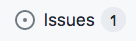

**_Issues_** is used to discuss ideas, flag issues and make collaboration easier.

Using the tabs will help keep many of the issues organized.

* **_Assignee_** to assign anyone that has access to the repo
* **_Labels_** which can have the name changed
* **_Filters_** can be used narrow down results based on **_Labels_**, **_Assignee_**, **_Open Status_**

### Key Features

* Having a history all in the one place
* Allowing users and developers to cross-link to each other share ideas, experience, bugs and other issues and other pull requests
* Ability to notify and link the right people with ``` @-mentions ```

<br>

## Managing Notifications

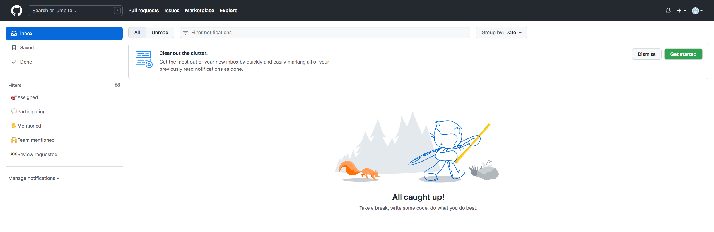

### Watching

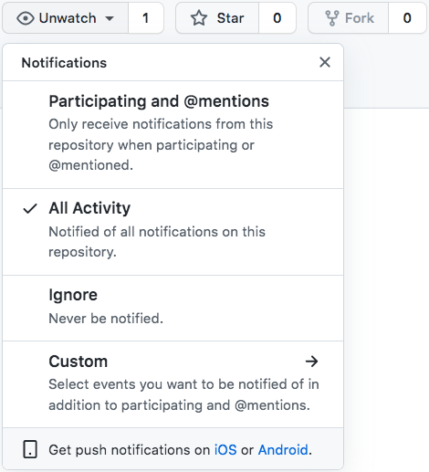

This is a setting used to stay up to date with the project via email or web notifications which can be changed in the settings

* **_Issue_**
* **_Pull Request_**
* **_Comment_**

The level of notification can be changed

* **Not Watch** (Notified with participating & mentions)
* **Watch** (Full Notifications)
* **Ignore**

There is also a way to manage all projects that are being watched

### Star

This is more of a bookmark to store favorite projects.

### Explore

This is a categorized section to help find projects.

<br>

## GitHub Pages

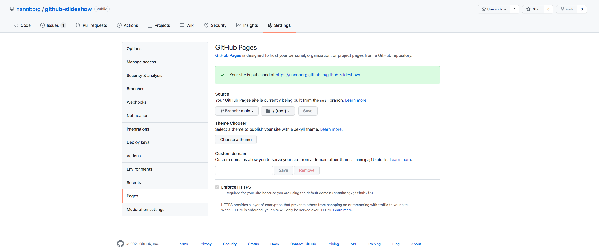

**_GitHub Pages_** serves as a static site.

<br>

## GitHub flow

### Branch

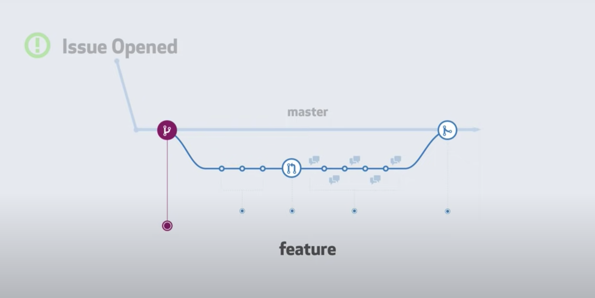

By default everything in git lives on a **_Branch_**. The main project will live on **_Master_**.

Git as a workflow offers the ability to experiment or address **_Open Issues_** on an alternate **_Feature Branch_** off **_Master_**, This will not compromise the original code.

A **_Feature Branch_** should have it's own descriptive name. Any **_Commits_** made will be stored on the **_Feature Branch_**.

When ready to discuss the changes made a **_Pull Request_** can be made. A **_Pull Request_**  does not have to be perfect at first. It's something the can be refined as more changes are made. 

Once the changes in the **_Pull Request_** have been approved, the **_Feature Branch_** can be **_Merged_** back with **_Master_** and the **_Issue_** can be closed.

### Creating a Branch

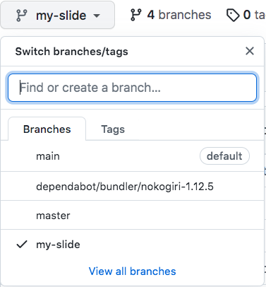

<br>

## Committing a File

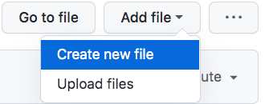

With in github there is the option to create a new file. This will also open up a basic editor.

Here you can give the file a name.

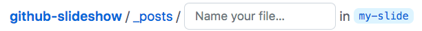

At the very bottom is where you can write a message with the commit message

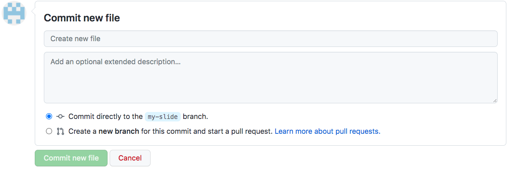

<br>

## Creating a Pull Request

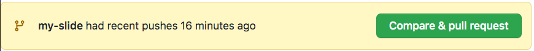

### What is a **_Pull Request_**?

When a change has been made and or completed it is time open a **_Pull Request_** to discuss the file with team mates. 

Github will know that files have been changed and will recommend to open a pull request, github will offer a drop down to compare any two branch's.

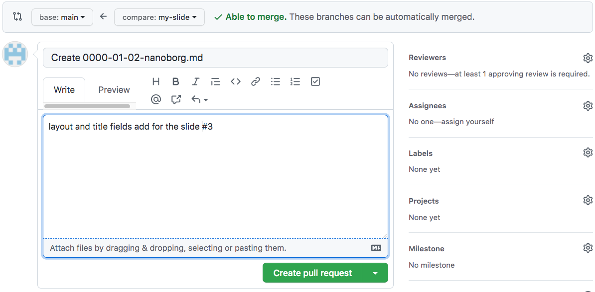

Github pre-populates the **_Pull Request_** with the **_Commit_** message. It can be updated to that others can better understand the intent of the change.

Below there is a **_Comment_** section to explain the changes that were made and why, as best practice to reference the original issue using the number sing notation **_#1_**.


When finished, choose the option to make a **_Create Pull Request_**

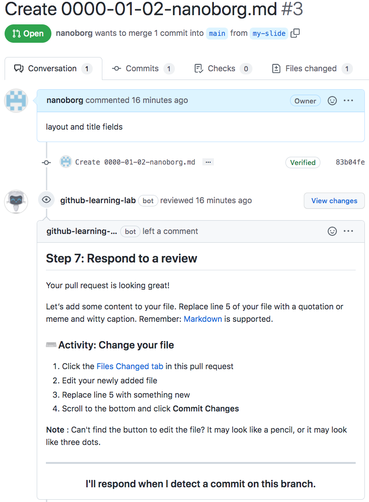

Similarly to how an **_Issue_** creates a discussion thread, a **_Pull Request_** creates a discussion on the changes being made to the repository. This is found under the **_Conversation_** tab.


### Files Changed

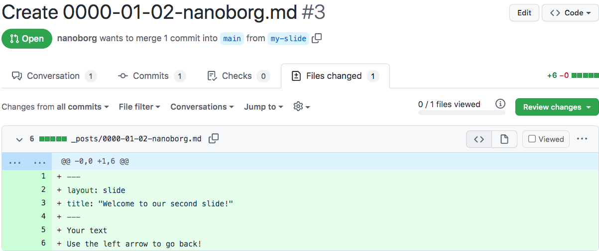

Here is where the change can be viewed which could be adding or removing of files.

* Text in **_Red_** is what has been removed
* Text in **_Green_** is what has been added

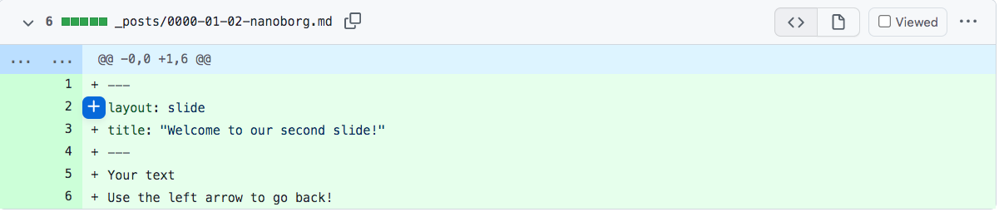

If there needs to be a **_change_** to the code, click on the **_Line Number_**

<br>

## Respond to a review

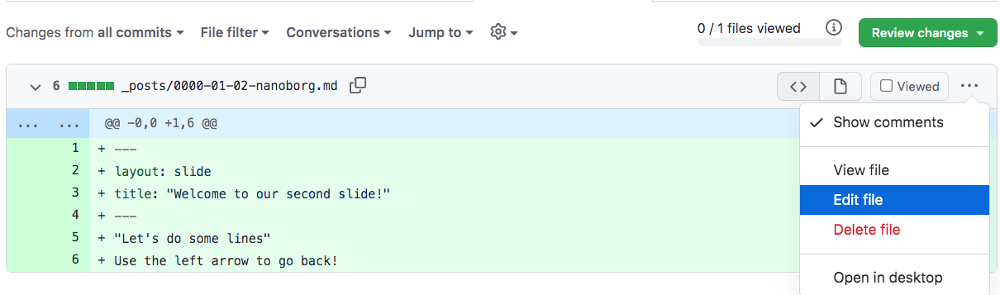

A file may need to be changed, if there are instructions follow them and edit the file using the file editor.

<br>

## Merge Pull Request

Once the **_Pull Request_** has passed all the reviews it can now be **_Merged_**. Click **_Merge Pull Request_**.

After the **_Branch_** has been **_Merged_**, the **_Branch_** can be deleted.


