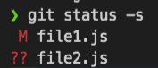
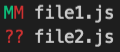
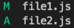
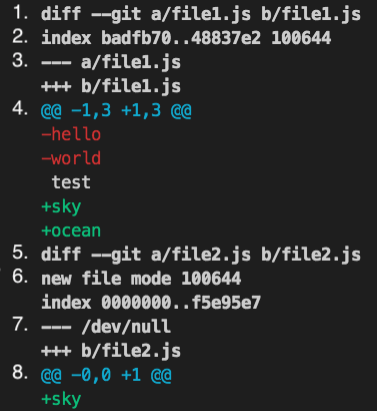
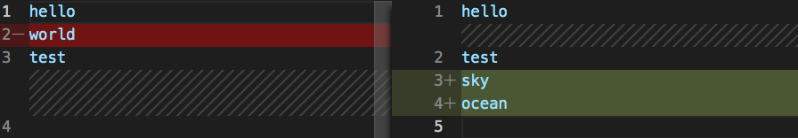
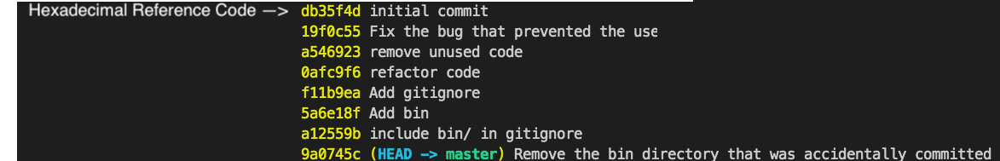

## How Does Git Workflow Work

Git has a special feature called **_staging_**, this allows people to review their work locally before taking a snapshot (**commit**). Each ` git add ` will be stored in the ` index ` file.

 

## Staging example

* Directory with 2 files    

        file1.txt file2.txt

* Staging

        git add file1.txt file2.txt

* Repo

        git commit -m "initial commit"

After files have been committed, they will stay be present in the staging area, **_They do not leave!_**

So, if `we` were to delete one of the files it will still compare working files with the staging files. You will need to `git add` the deleted file so it can be removed from staging or we could ` git rm file.txt `

 
 

## Managing different versions
Git is very efficient at storing changes.

* It will not store duplicate content.
* It will compress the content

There is not really much to know in how it works, just need to know that each commit is a new snapshot of the project.

 
 

## Staging Files
### Adding Files
 There are different commands we can use to add files to the staging section. 

    git add file1.txt file2.txt 

 For instance we can use patterns, everything ending in .txt 

    git add *.txt 

Can also add the whole directory, but should be used with caution as we may not want to add everything in that directory.   

    git add . 

 

### Status

Now that there are files added to the staging area we can check to see the status. It will be able to compare the working directory files to the staging files.

> ` git status `

This might return modified. This means there is a file that has had changes made and has not been added to the stage.

 
 

## Committing Changes

Each commit will contain data:
    
* ID
* Message
* Date/Time
* Author
* Complete Snapshot

If everything is good in the **_staging_** area it is ready to be **_committed_** with a message or short summary of what the new file or change was. This will be stored in the ` head ` file.

> ` git commit -m "Initial Commit" `

There may be times when one line is not enough, it might be better to have extra details to give context or constraints with the code.

> ` git commit `

This will open up the default editor which should be set up already.

There should be exact copies of the code in **_Working Directory_**, **_Staging_** and **_Repository_**

 
 

## Committing Best Practice

### Do's

* Create meaningful messages.
* Commit each change separately.

### Don'ts

* Should __not__ be too **_big_** or too **_small_**.
* Should __not__ commit too **frequently**.
* Should __not__ commit too **_infrequently_**, don't want the changes to get too big

### ___"Golden Rule is to commit often"___

* Commit when reaching a state can be recorded.
* Each commit should represent a logical chain set.

For example if there is a **_bug_** or **_typo_**, They should be separate **_commits_**

If a circumstance happens where both changes have been part of the same commit there is a way to un-stage the file.

 

### Wording

Present vs Past

Most commons practice is to use the **_Present\*_** tense but any convention can be fine. Just be one the same page as everyone else working on the project.

__Present__: "Fix the bug"

__Past__: "Fixed the bug"

 

### Skip the Staging Area

Do we have to stage?..

> No, we don't have to, but we need to know what we are doing. Most of the time we should always stage before committing!!

In the case of making a change to a file, we can commit directly by using the `-a` (all) flag

    git commit -a -m    

or combine them

    git commit -am "all and message combined"   

 
 

## Removing Files

Im the case a file is no longer needed it can be removed using terminal.

    rm file2.txt  (standard unix command)

Even though the file may be deleted it is still in the staging area, which can be viewed by

    git status ls-files

To remove the file from the staging area it will need to be added.

    git add file2.txt 

Now when checking the status, the file will be deleted.

The final step will be to delete it from the repo.

    git commit -m "Remove unused code."

This can be a lengthy process, instead of going through those steps, git offers a shorter way to get this done.

    git rm file2.txt file.txt *.txt

 
 

## Renaming or Moving Files

Command                     | Action
 ---                        | ---           
`mv text1.txt main.js`      | Using unix code to rename the file
`git add text1.txt`         | Will need to add the new file to track it

 
 

1. Using unix code rename the a file
    
        mv text1.txt main.js

> Running git status will tell us that _file1.txt_ has been __deleted__ and _main.js_ is untracked.

2. To remove text1.txt we need to add it

        git add text1.txt

3. and we need to stage the new file being created.

        git add main.js

This is a multi-step process just as it was for deleting, Git also provides a shortcut for this.

    git mv main.js file1.js

Status will show the file has been renamed and that there was no new insertions.

 
 

## Ignoring Files (not committed)

In almost every project we should tell **_git_** to **_ignore_** certain files or directories, for example

* log files 
* binary files as a result of compiling code

If there is a directory such as `logs/`

Will need to ignore it by creating a `.gitignore` file in the root of the directory.

edit the file. 

> ` code .gitignore`

Checking the `git status` will show that **_log_** directory is not there. It will show that the `.gitigonre` file is un-staged.

> `git add .gitignore`

> `git commit -m "add .gitignore"`

This will only ignore files and directories before they have been committed. So if we have a file in the **_Repository_** then add that same file to .gitignore it will **_not_** ignore it.

 
 

## Ignoring Files (Committed)

In the instance we want to **_ignore_** a file that has already been **_committed_**

We do not want to remove the file from the working director, We just need it removed from the **_staging_** area.

You will need to look at the `git rm -h` options to remove it from the staging area.

    git rm [<options>] [--] <file>...

    -n, --dry-run         dry run
    -q, --quiet           do not list removed files
    --cached              only remove from the index
    -f, --force           override the up-to-date check
    -r                    allow recursive removal
    --ignore-unmatch      exit with a zero status even if nothing matched
    --pathspec-from-file <file>
                          read pathspec from file
    --pathspec-file-nul   with --pathspec-from-file, pathspec elements are separated with NUL character

Using ` git rm --cached -r ` will recursively remove the file from the **_staging_** area and it will no longer be tracked.

 

### .gitignore Templates

GitHub has a list of files for different languages that we should ignore

[.gitignore templates](https://github.com/github/gitignore)

 
 

## Short Status

When adding files or directories to git, reading the changes can be a big lengthy. To shorten the information displayed we can use the ` git status -s ` command

This will show short hand information about the file 

In the **Left** column is the staging area and the **Right** is the working directory

Symbol                      | Meaning
 ---                        | ---           
M                           | Modified
??                          | Untracked files
A                           | Added

Here there is 2 MM, One **_Green_** and the other **_Red_**. This is telling us that there is one tracked file and there has also been further modifications to it.

Here there is a **_Green_** A, This is tell us a file has been added.

 
 

## Viewing the Staged & Un-staged Changes

As best practice always review what is in the stage area before making a commit.

` git status ` command will only show the files that have been affected. 

To see the exact lines of code we can type 

    git diff --staged

While it's not generally the best way to view when using the terminal, It's good to know for the times when there is no other option to view or in case of an interview.

### Example

1. Diff utility call, The first line of the output is comparing file A to B

* A - The last **_Commit_**
* B - The new file in the **_Staging_**

2. Index, this has some meta data which is not important 

3. Ledger, indicating the changes

    * \- indicates changes in the old copy
    * \+ indicates changes in the new copy

4. Header, information on what parts of the files has changed. Git will divide the changes into chunks.

    * `-1,3` is the previous file, starting from the first line, showing 3 lines, red meaning they have been deleted.

    * `+1,5` in the new file, starting from the first line, showing 5 lines, green meaning they are new lines.

5. New call to the index utility, trying to compare to the previous file

6. As there is no existing `file2.js` It will create a new instance of the file to be added. 

7. Ledger, again no existing `file2.js` to compare with

8. Header, start @ `-0,0` as there is no file and no lines.

 
 
### Working Tree Difference

`git diff` will show the difference between the **_Working Directory_** and **_Staged Area_**.

`git diff --staged` will show the changes in the **_Staged Area_** that are going to go in the next **_Commit_**

 

## Visual Diff Tools

* KDiff3
* P4Merge
* WinMerge  (Windows only)
* VSCode

### Set Up Difftool for VSCode

1. 
        git config --global diff.tool vscode
    
2. 
        git config --global difftool.vscode.cmd "code --wait --diff $LOCAL $REMOTE

3. Open the global config file to make sure the all changed have been made
        
        git  config --global -e

4. Run the new command that we created to have a better visual overview of what files have been changed.

        git difftool or git difftool --staged

It is much easier to see the changes.

 
 

## Viewing the History

If we want to see the progress of all the **_Commits_** we can check out the log.

    git log 
    git log --oneline 
    git log --oneline --reverse 

 
 

## Viewing a Commit

Showing the order of the **_Commit_** is great but does not show the content of the **_Commit_**, for this we need ` git show `

    git show <reference code>

another way is to use the head pointer

    git show HEAD
    or
    git show HEAD~1 (the tilde and number of commits back)

This will show the **_Diff_** data between working tree and staged.

If we want to see the exact version that is stored in this **_Commit_**

    git show HEAD~1:.gitignore

If we want to see the complete file and directory tree we type

    git ls-tree <reference commit code>
    or
    git ls-tree HEAD~1

 
 
 
## Viewing Objects

Using **_Show_** we are able to view any **_Object_** in gits database using the reference code of the **_Object_**

Git objects:
* Commits
* Blobs (files)
* Trees (directories)
* Tags

 
 

## Un-staging Files

If you do not want **_Staged_** changes to go in a commit you can un-stage the files using ` git restore `

    git restore --staged file1.js

Git will remove the first **_Green_** letter, It does this by adding the last known snapshot from the **_Commit_**

 
 

## Discarding Local Changes

If we made some changes to the **_Working Directory_** which we are not happy with, we can restore the file from the **_Staging Area_** using ` git restore `

    git restore <file> or <directory>

How ever this will not remove **_Un-tracked_** files, for this we will need to use ` git clean `. This can be **_Dangerous_** as these are untracked files and can not be recovered!

    git clean -fd <force> or <directory>

 
 

## Restoring a File to an Earlier Version

If a file has been **_Deleted_** from the both the **_Working Directory_** and the **_Staging Area_** it can be restored to the **_Working Directory_** from the last **_Commit_** using ` git restore `

    git restore [<options>] [--source=<branch>] <file>...

    git restore --source=HEAD~1

The file will now be **_Restored_** to the **_Working Directory_**