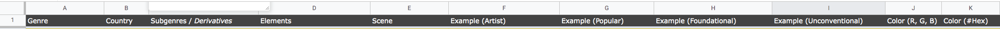
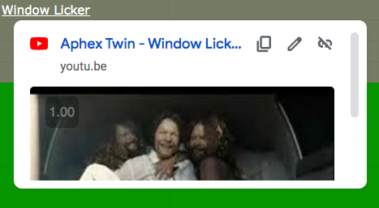

# Sheets Formatting Tips

## Freeze rows or columns in the same position so you can see it as you scroll along the page



> ``` View / Freeze / 1 row ```

<br>

## Hyperlink within the cell



> ``` cmd + k ```

> ``` =HYPERLINK("https://youtu.be/7MBaEEODzU0?t=4m20s", Window Licker) ```


<br>

