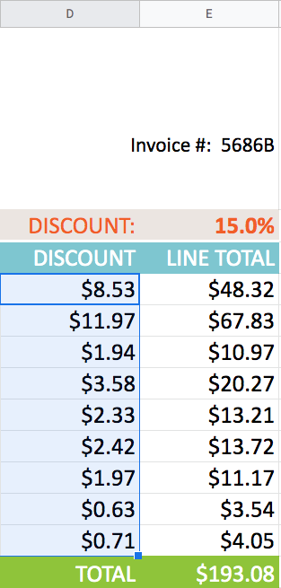
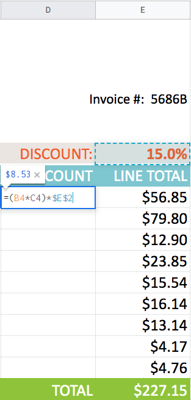

# Sheets Formula

## Mathematical Operators / Cell Reference

    =A1+A2
    =A1-A2
    =A1*A2
    =A1/A2

 

## Add A Range Of Cells in a Column

    =SUM(A1:A10)

 

## Complex Formulas & Order of Operations

The order of in which operations are handled are as follows

    P = () = Parenthesis
    E = ^ = Exponent
    M = * = Multiplication
    D = / = Division
    A = + = Addition
    S = - = Subtraction

> It can be remembered as mnemonic "Please Excuse My Dear Aunty Sally"

### Calculate 20% of the total

    =(A1+A2+A3)*.2
    =SUM(A1:A8)*.2
    
 

## Relative & Absolute Reference

* Relative Cell Reference changes when a formula copied to other cells

* Absolute References remain constant

### **_Relative_**

This is great for when you want to apply the same formula across different cells

### **_Absolute_**

When you want a constant value to remain across all the copied cells

 

