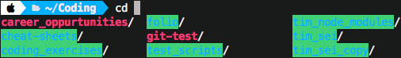

# Install Oh My Zsh

1. Have iterm installed

2. Run this line in iterm, check current at [ohmyzsh](https://github.com/ohmyzsh/ohmyzsh)

        sh -c "$(curl -fsSL https://raw.githubusercontent.com/ohmyzsh/ohmyzsh/master/tools/install.sh)" 

 

## Disable Other Writable Highlighting

To stop the ugly highlighting of files and folders 

Paste into `.zshrc` at the bottom of the page.

        # Autocomplete colors
        #
        # Based on the oh-my-zsh default `LSCOLORS`. Converted with the help of the
        # Geoff Greer's lscolors project.
        # See: https://geoff.greer.fm/lscolors/
        _ls_colors="tw=1;34:ow=1;34"
        zstyle ':completion:*:default' list-colors "${(s.:.)_ls_colors}"

More info can be found [here..](https://askubuntu.com/questions/17299/what-do-the-different-colors-mean-in-ls)

 

## Disable `ls` Highlighting

Uncomment in `.zshrc`

        # Uncomment the following line to disable colors in ls.
        DISABLE_LS_COLORS="true"