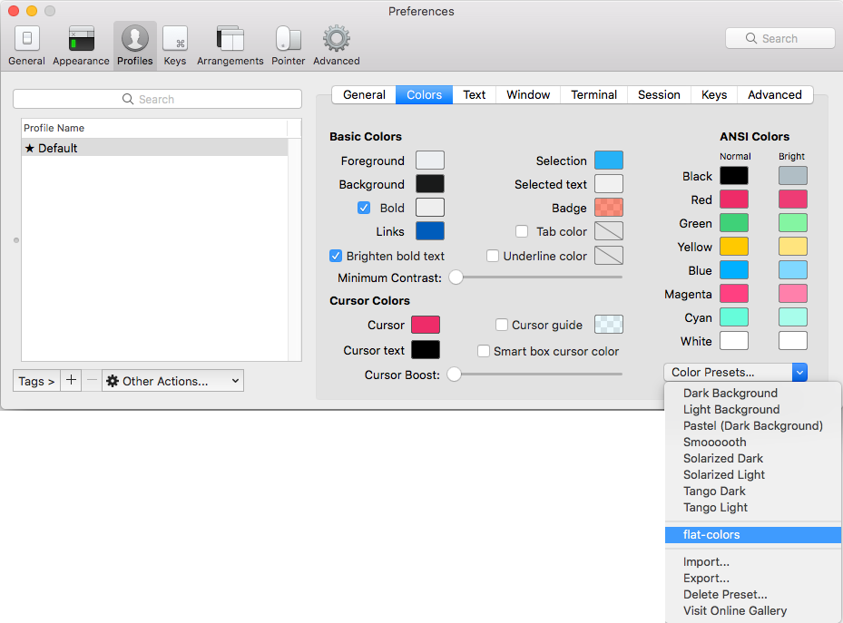
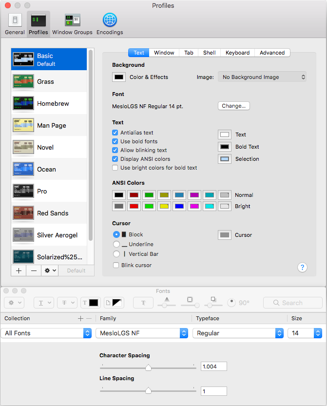

# Install Powerlevel10k

1. Run this line in iterm, check current at [romkatv](https://github.com/romkatv/powerlevel10k)
        
        git clone --depth=1 https://github.com/romkatv/powerlevel10k.git ~/powerlevel10k
        echo 'source ~/powerlevel10k/powerlevel10k.zsh-theme' >>~/.zshrc

 

2. ## Edit .zshrc

2. Edit ` ~/.zshrc `

Comment out:

        # ZSH_THEME="powerlevel10k/powerlevel10k"

3. Uncomment the following line to disable colors in ls.

        DISABLE_LS_COLORS="true"

4. Hide the **_powerlevel10k_** directory so it doesn't show up all the time:
        
        chflags hidden /Users/tim/powerlevel10k

 

## Configure Powerlevel10k

1. Restart iterm and go through configuration process or type  

        p10k configure

 

        * Can you see the diamond? 
        * Can you see the lock?
        * Do all the icons fit between the crosses

 

If **Not**, follow the prompt to install from **iTerm**

 

        * Prompt Style = (3) Rainbow
        * Character set = (1) Unicode
        * Show current time? = No
        * Prompt Separator = (1) Angled
        * Prompt Heads = (1) Sharp
        * Prompt Tails = (1) Flat
        * Prompt Height = (1) One line
        * Prompt Spacing = (1) Compact
        * Icons = (2) Many icons
        * Prompt Flow = (1) Concise
        * Enable Transparent Prompt? = yes

 

## MesloLGN NF Font

1. May need to install mesloLGN NF font ?

2. Select ` mesloLGN NF ` font from the

 

## Colour Theme

1. Download [Dark Flat](https://github.com/QuentinWatt/dark-flat-iterm-colors)

2. Immport & Select `Dark Flat` from drop down

 

## Text Size

`15`

  

# Powerlevel10k on other terminnals

## VS code

    "terminal.integrated.fontFamily": "MesloLGS NF",
    "terminal.external.osxExec": "iTerm.app",
    "terminal.integrated.shell.osx": "/bin/zsh"

## Mac Terminal

